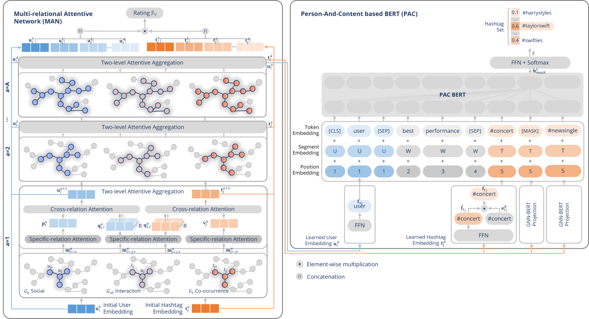

# PAC-MAN

This repository contains the TensorFlow and PyTorch implementation for the IEEE Access paper: [PAC-MAN: Multi-Relation Network in Social Community for Personalized Hashtag Recommendation](https://ieeexplore.ieee.org/document/9984162)
> Padungkiatwattana, U., & Maneeroj, S. (2022). PAC-MAN: Multi-Relation Network in Social Community for Personalized Hashtag Recommendation. IEEE Access, 10, 131202-131228.

# Introduction

<p align="left">

</p>

PAC-MAN is a novel integral model for personalized hashtag recommendation, which has three main contributions:

:bulb: *First*, to derive fruitful user and hashtag representation from higher-order multiple relations, we propose **Multi-relational Attentive Network (MAN)** by applying GNN to jointly capture relations in three communities: (1) user-hashtag interaction (e.g., post, retweet, like); (2) user-user social (e.g., follow); and (3) hashtag-hashtag co-occurrence.

:bulb: *Second*, to personalize content at the word level, **Person-And-Content based BERT (PAC)** extends BERT to input not only word representations from the microblog but also the fruitful user representation from MAN, allowing each word to be fused with user aspects.

:bulb: *Third*, to capture sequenceless hashtag correlations, the fruitful hashtag representations from MAN that contain the hashtag’s community perspectives are inserted into BERT to integrate with the hashtag’s word-semantic perspectives, and a hashtag prediction task is then conducted under the *mask concept* for the recommendation.


# Person-And-Content based BERT (PACBERT)

## Dependencies
The script has been tested under the following dependencies:
* `torch==2.0.0`
* `transformers==4.27.4`
* `tensorboard==2.12.1`
* `scipy==1.10.1`
* `omegaconf==2.3.0`
* `tqdm==4.65.0`

Install all dependencies:
```bash
pip install -r pacbert/requirements.txt
```


## Usage

### :gear: Configuration
Manage configuration for the model at `pacbert/config/config.yaml`.

### :chart_with_upwards_trend: Dataset
Prepare datasets and organize them as follows: 
```
data
└─ twitter
    └─ twitter_train.json
    └─ twitter_val.json
    └─ twitter_test.json
    └─ tag.txt
```

Here is an example of data structure:
```json
[
    {
        "user": 0,
        "text": "the way to get started is to quit talking and begin doing.",
        "tag": ["life", "inspire", "goal"]
    }
]
```


### :rocket: Model Training

#### :sparkles: Non-Distributed Training
You can train the model by using `run.sh`.
```bash
pacbert/scripts/run.sh
```

You can also parse arguments to the script:
```bash
pacbert/scripts/run.sh [$CONFIG]
```

where:
* `$CONFIG` - Configuration path.


#### :sparkles: Distributed Training on Single Node
You can perform distributed training on a single node by using `run_single.sh`.
```bash
pacbert/scripts/run_single.sh
```

You can also parse arguments to the script:
```bash
pacbert/scripts/run_single.sh [$NUM_TRAINERS] [$CONFIG]
```

where:
* `$NUM_TRAINERS` - Number of GPUs/CPUs.
* `$CONFIG` - Configuration path.


#### :sparkles: Distributed Training on Multiple Nodes
You can perform distributed training on multiple nodes by using `run_multi.sh`.
```bash
pacbert/scripts/run_multi.sh
```

You can also parse arguments to the script:
```bash
pacbert/scripts/run_multi.sh [$NUM_NODES] [$NUM_TRAINERS] [$NODE_RANK] [$MASTER_ADDR] [$MASTER_PORT] [$CONFIG]
```

where:
* `$NUM_NODES` - Number of machines.
* `$NUM_TRAINERS` - Number of GPUs/CPUs.
* `$NODE_RANK` - Global rank.
* `$MASTER_ADDR` - Master address.
* `$MASTER_PORT` - Master port.
* `$CONFIG` - Configuration path.

For example, running on multiple GPUs across 2 nodes.
* On master node with 2 GPUs:
```bash
pacbert/scripts/run_multi.sh 2 2 0 123.456.789 1234
```

* On worker node with 4 GPUs:
```bash
pacbert/scripts/run_multi.sh 2 4 1 123.456.789 1234
```

### :pushpin: Checkpoint and Logging
After training, the following files are created:
* `ckpt.pt` - Model checkpoint.
* `logs/` - Tensorboard logs.
* `result.json` - Training results containing train_loss, val_loss, and metrics.

# Citation
If you find our work useful for your research, please cite the following paper:

```bibtex
@ARTICLE{9984162,
  author={Padungkiatwattana, Umaporn and Maneeroj, Saranya},
  journal={IEEE Access}, 
  title={PAC-MAN: Multi-Relation Network in Social Community for Personalized Hashtag Recommendation}, 
  year={2022},
  volume={10},
  number={},
  pages={131202-131228},
  doi={10.1109/ACCESS.2022.3229082}}
```
